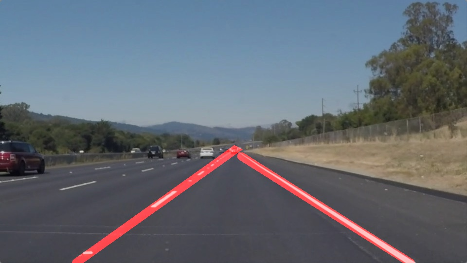

# **Finding Lane Lines on the Road** 

Zoltán Puha - Udacity SDC ND Term 1 - Project 1.
---

**Finding Lane Lines on the Road**

## Output 

---

### Reflection

### 1. My pipeline

My pipeline consisted of steps that followed the logic presented in the videos.
First, make a copy of the image, then create a grayscale img from the copy. Then apply masking on the image, to get the region of interest. I have set up the region of interest, as a triangle in the bottom of the picture. After this, I applied Gaussian bluring to remove not clear gradients. Then, I applied canny edge detection to get the edges from gradients and used these for the Hough transform to get the lines.

After this, I had good points, but they were not lines. 
In making the lines, I tried to be as robust as possible. 
First, I selected, which line (from the HT) can be associated with the left or the right lane (I took the ones left from the middle of the RoI, to the left, and vice versa). Then, I averaged these points and fitted a linear regression for the left and for the right lane as well. I saw, that the slope from the regression was not perfect, so I modified it.

I made a rolling window for three variables for both lanes.

#### 1. The point of where the red lines start. 
These can be calculated from the regression, as we know the intercept, the size of the image and the slope. $ p = (size - intercept)/slope $
This value first get initiated, then if it needs change, it happens smoothly (the value of this value in t time depends of the value in t-1 time)

#### 2. The slope of the lane. 
This also gets updated, but here I also use the slopes of the lines of the HT. This value also slowly changes over time, to overcome the problem of jumping lines.

#### 3. The intercept of the lane. 
Also adjusted over time. 

### 2. Identify potential shortcomings with your current pipeline
- I can see that for some lanes, my solution doesn't show the whole line.
- Also, these adjusting approach has a lot of free parameters, so tuning it is hard. 
- Also, the model is not suitable for really quick changes in lanes, but these could be fine tuned.

### 3. Possible improvements

Remove the global variables from the code.
It could be nice, to put the whole problem as a learning problem, but without labels it would be hard. 
